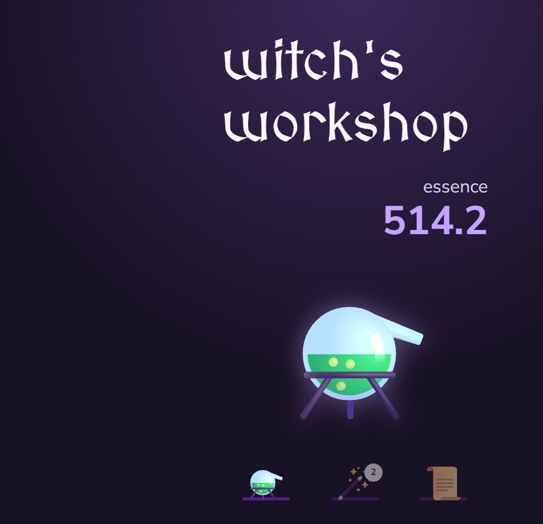
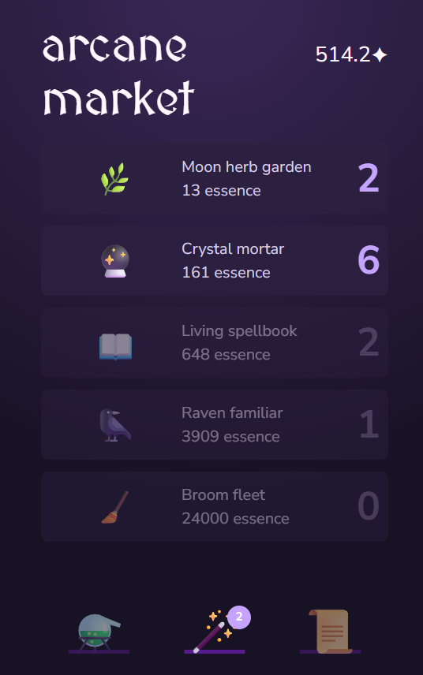
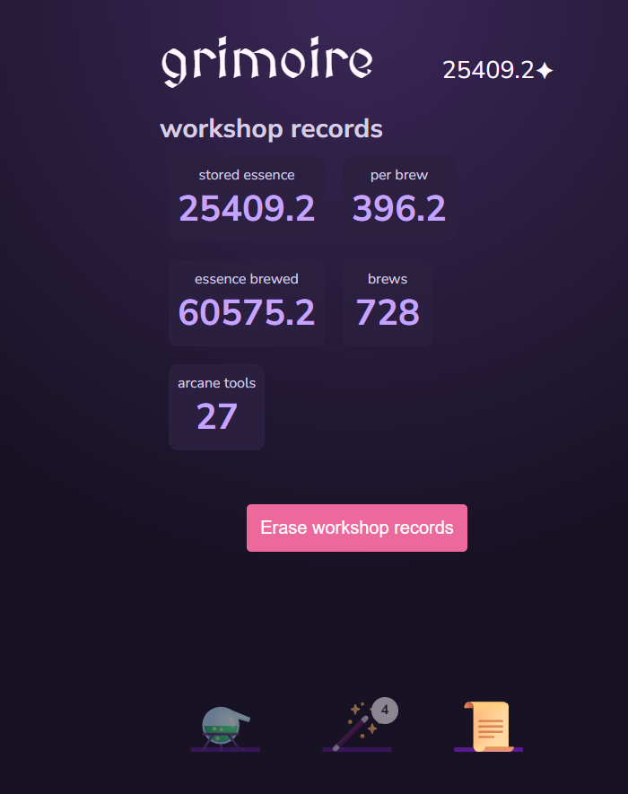

# Witch's Workshop

**Witch's Workshop** is a small browser-based incremental game. Brew essence in a glowing cauldron, grow an arcane operation through the market, and watch your workshop records grow over time.

The game is designed for quick sessions on desktop or mobile. Progress is saved automatically in the browser.

## Screenshots

<table>
  <tr>
    <td align="center"><strong>Workshop</strong></td>
    <td align="center"><strong>Arcane Market</strong></td>
    <td align="center"><strong>Grimoire</strong></td>
  </tr>
  <tr>
    <td></td>
    <td></td>
    <td></td>
  </tr>
</table>

## Features

- Click the cauldron to brew essence.
- Buy magical tools that increase essence gained per brew.
- Follow your progress in the Grimoire.
- Keep progress in browser storage between sessions.
- Installable progressive web app with offline support.
- Responsive layout for phone and desktop screens.

## Getting started

You need a current version of Node.js and npm.

```bash
npm install
npm run dev
```

Vite prints a local address, normally `http://localhost:5173`. Open it in a browser to play.

## Available scripts

| Command | Purpose |
| --- | --- |
| `npm run dev` | Start the development server. |
| `npm run build` | Create an optimized production build in `dist/`. |
| `npm run preview` | Serve the production build locally. |
| `npm run lint` | Check the source code with ESLint. |

## How to play

1. Brew essence by clicking the cauldron.
2. Open the **Arcane Market** with the wand icon.
3. Spend essence on tools such as Moon herb gardens, Crystal mortars, and Living spellbooks.
4. Return to the workshop: each purchase permanently improves your brewing power.
5. Open the **Grimoire** to review your totals or erase local progress.

## Saving progress

Witch's Workshop stores game progress in the browser's local storage. This means a save belongs to the browser and device where it was created. Clearing browser site data or using the erase action removes that local save.

## Publishing

The game is a static web application. Build it with:

```bash
npm run build
```

Upload the contents of `dist/` to any static web server. The repository includes a `staticwebapp.config.json` file for single-page application routing on Azure Static Web Apps.

## Project structure

```text
src/
├── components/    Reusable interface components
├── config/        Upgrade definitions
├── pages/         Workshop, market, and Grimoire views
├── utils/         Saving and number-formatting helpers
└── App.jsx        Game state and purchase logic
```
